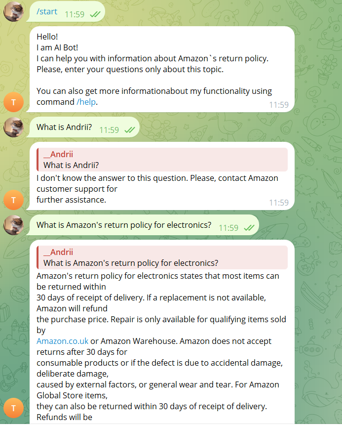

# AWS AI BOT
This is a script of a chat-bot that answers questions about the Amazon Returns Policies document and communicate with user via telegram.

## How Setup and Execution code

1. **Clone the repository**:
    ```sh
    git clone https://github.com/Andrii-Bezkrovnyi/telegram_aws_ai_bot.git
    ```

2. **Create a virtual environment**:
    ```sh
    python -m venv venv
    venv\Scripts\activate (on Windows) 
    source venv/bin/activate  (on Linux)
    ```

3. **Install the required packages**:
    ```sh
    pip install -r requirements.txt
    ```

4. **Configuring environment variables:**

   Create a .env file in the project directory with the following content:

    ```
   OPENAI_API_KEY: The api key of your openai account.
   TELEGRAM_BOT_TOKEN: The token of your telegram bot creating via you account.
    ```

5. **Start the ASW AI BOT via script and communicate with bot via console**:
    
   ```sh
    python telebot.py
    ```   
   
6. **Sample query for demonstration**

   ```sh
   What is Amazon's return policy for electronics?
   ```

   ```sh
   What is Andrii?
   ```


### Logging:
    
The script of AI Bot records its operations and any errors in the bot_info.log file for debugging and monitoring

## Example of bot work
